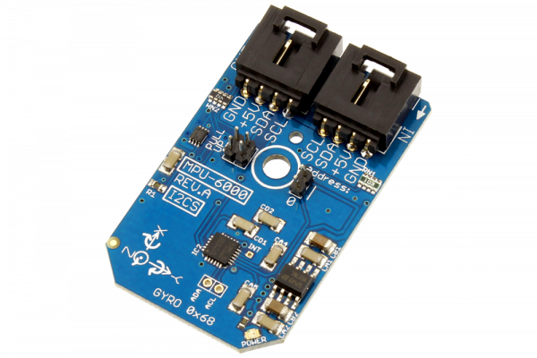

# MPU6000

InvenSense’s MPU-6000 is the world’s first integrated 6-axis MotionTracking device that combines a 3-axis gyroscope, 3-axis accelerometer, and a Digital Motion Processor™ (DMP). With its dedicated I2C sensor bus, it directly accepts inputs from an external 3-axis compass to provide a complete 9-axis MotionFusion™ output.
This Device is available from www.ncd.io 

[SKU: MPU6000_I2CS]

(https://store.ncd.io/product/mpu-6000-aka-mpu-6050-6-axis-motiontracking-3-axis-gyroscope-3-axis-accelerometer-digital-motion-processor-i2c-mini-module/)
This Sample code can be used with Arduino.

Hardware needed to interface MPU6000 sensor with Arduino

1. <a href="https://store.ncd.io/product/i2c-shield-for-arduino-nano/">Arduino Nano</a>

2. <a href="https://store.ncd.io/product/i2c-shield-for-arduino-micro-with-i2c-expansion-port/">Arduino Micro</a>

3. <a href="https://store.ncd.io/product/i2c-shield-for-arduino-uno/">Arduino uno</a>

4. <a href="https://store.ncd.io/product/dual-i2c-shield-for-arduino-due-with-modular-communications-interface/">Arduino Due</a>

5. <a href="https://store.ncd.io/product/mpu-6000-aka-mpu-6050-6-axis-motiontracking-3-axis-gyroscope-3-axis-accelerometer-digital-motion-processor-i2c-mini-module/">MPU6000 6Axis Motion Tracking and 3Axis Gyroscope and 3Axis Accelometer Sensor</a>

6. <a href="https://store.ncd.io/product/i%C2%B2c-cable/">I2C Cable</a>

MPU6000:

InvenSense’s MPU-6000 is the world’s first integrated 6-axis MotionTracking device that combines a 3-axis gyroscope, 3-axis accelerometer, and a Digital Motion Processor™ (DMP). With its dedicated I2C sensor bus, it directly accepts inputs from an external 3-axis compass to provide a complete 9-axis MotionFusion™ output.

Applications:

• BlurFree™ technology (for Video/Still Image Stabilization)

• AirSign™ technology (for Security/Authentication)

• TouchAnywhere™ technology (for “no touch” UI Application Control/Navigation)

• MotionCommand™ technology (for Gesture Short-cuts)

• Location based services, points of interest, and dead reckoning

• Handset and portable gaming

• Motion-based game controllers

• 3D remote controls for Internet connected DTVs and set top boxes, 3D mice

How to Use the MPU6000 Arduino Library

The MPU6000 has a number of settings, which can be configured based on user requirements.
          
1.Gyro range selection:The following command is used to select the range of Gyro.

           mpu.setGyroRange(GYRO_RANGE_2000);                  // ± 2000 °/s
           
2.Acceleration range selection:The following command is used to select the range of acceleration.

            mpu.setAccelRange(ACCEL_RANGE_16G);                 // 16 g
             
3.Clock cycle mode:The following command is used to set PLL with X-Axis Gyroscope Reference.             
             
            mpu.setClockSource(CLOCK_SOURCE_PLL_X_REF);         // PLL with X-Axis Gyroscope Reference
